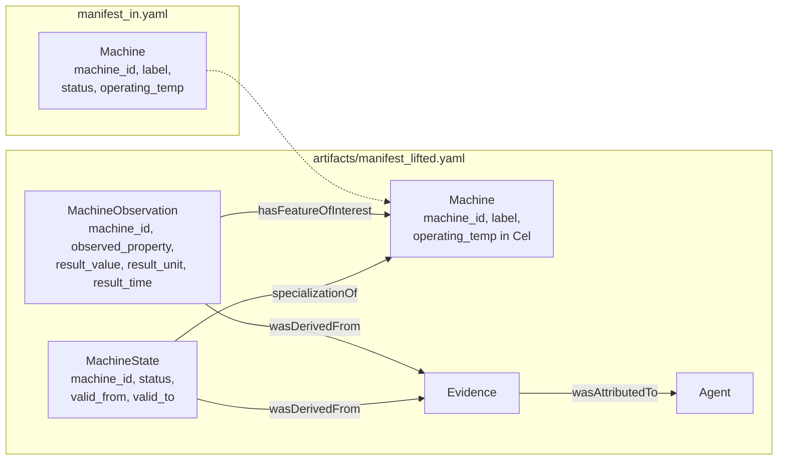

# How do I turn a plain schema into one that tracks state and measurements over time?

Your manifest describes the machines on a plant floor and the production lines
they are installed on. A machine has a `status` and an `operating_temp`, stored
as properties of the machine. Each holds one value: when the status changes,
the old value is gone, and nothing in the schema says when a value was true,
where it came from, or in which unit a temperature is given. "What was this
machine's status last March, and who reported it?" has no answer.

`graflo lift` rewrites the manifest so that it can answer. Values that change
move to their own type with a validity interval, measurements get a type with a
time and a unit, and two new types record where a fact came from and who
reported it. You declare what the schema cannot say by itself; the lift writes
the rest as a list of changes that you can review before you apply them.



## What you need

- GraFlo installed (`pip install graflo`). No database is needed.

## The data

There are no data files: the lift changes the manifest. The `Machine` type of
[`manifest_in.yaml`](manifest_in.yaml):

```yaml
-   name: Machine
    description: A machine on the plant floor.
    properties:
    -   {name: machine_id, type: STRING}
    -   {name: label, type: STRING}
    -   {name: status, type: STRING}
    -   {name: operating_temp, type: FLOAT}
    identity: [machine_id]
```

`ProductionLine` has `line_id`, `label` and `operating_mode`. Two edges,
`installed_on` (machine to line) and `feeds` (machine to machine), do not say
whether they are directed.

## Steps

### 1. Check the manifest against the profile

A conformance profile is a set of checks that GraFlo runs on a manifest. The
`world-model` profile asks whether the manifest can say what its types mean,
when a fact was true and where it came from:

| Check | Passes when |
|---|---|
| `grounded-types` | every vertex and edge names the concept it denotes by an IRI (`semantics.iri` or `semantics.exact_match`) |
| `declared-identity` | every vertex declares how it is identified, instead of falling back to all its properties |
| `declared-directionality` | every edge states `directed` instead of taking the default |
| `declared-units` | every float property outside the key has a unit, or its type has a property that carries the unit in each row |
| `temporal` | at least one date-time property is grounded in a validity or observation-time vocabulary |
| `provenance` | one vertex type is grounded as an agent, and one edge in a derivation or attribution property |

```bash
cd examples/23-state-core-lift
uv run graflo check --profile world-model manifest_in.yaml
```

```text
profile world-model v0.1 -- manifest_in.yaml
  overall: FAIL

  [  FAIL] grounded-types: Types are grounded in an external vocabulary  (4 checked)
           - vertex:Machine: no semantics.iri or semantics.exact_match
           - vertex:ProductionLine: no semantics.iri or semantics.exact_match
           - edge:Machine-installed_on->ProductionLine: no semantics.iri or semantics.exact_match
           - edge:Machine-feeds->Machine: no semantics.iri or semantics.exact_match
  [  PASS] declared-identity: Every vertex declares an identity mode  (2 checked)
  [  FAIL] declared-directionality: Every edge declares its directionality  (2 checked)
           - edge:Machine-installed_on->ProductionLine: does not declare `directed`; it defaulted to True
           - edge:Machine-feeds->Machine: does not declare `directed`; it defaulted to True
  [  FAIL] declared-units: Every measured property carries a unit  (1 checked)
           - vertex:Machine.operating_temp: measured property carries no unit, and its type declares no unit-valued property to carry one per row
  [  FAIL] temporal: Temporal validity is declared or waived  (1 checked)
           - manifest: no property is grounded in a validity or observation-time vocabulary, so the model cannot say when a fact was true; declare one or waive this assertion with a reason
  [  FAIL] provenance: Provenance is expressible and attached  (4 checked)
           - manifest: no vertex is grounded as an agent, so a fact has nothing to be attributed to
           - manifest: no edge is grounded in a derivation or attribution property, so the model cannot record where a fact came from
           - manifest: manifest declares no ingestion model, so whether provenance is attached at ingest was not checked
```

Five of the six checks fail. Identity passes, because each type names its key.
The command exits with code 1.

### 2. Declare what the schema cannot say

The lift can see structure: which edges leave `directed` unstated, which types
have no IRI, which floats have no unit. It cannot see meaning, so
[`lift.yaml`](lift.yaml) declares four things:

| Keys | What they say |
|---|---|
| `grounding`, `edge_grounding` | what each type and relation denotes, as IRIs from PROV-O and SOSA |
| `stateful` | which properties are facts that change over time |
| `observed` | which types are measured at a point in time |
| `measured` | the unit of an existing measurement, as a UCUM code (`Cel` is degrees Celsius) |

```yaml
grounding:
    Machine:
        iri: http://www.w3.org/ns/prov#Entity
        exact_match:
        -   http://www.w3.org/ns/prov#Entity
        -   http://www.w3.org/ns/sosa/FeatureOfInterest
# ProductionLine and the two edges are grounded the same way

stateful:
    Machine: [status]
    ProductionLine: [operating_mode]

observed: [Machine]

measured:
    Machine.operating_temp: Cel
```

### 3. Lift the manifest

```bash
uv run graflo lift manifest_in.yaml --spec lift.yaml \
    --emit-ops artifacts/ops.yaml -o artifacts/manifest_lifted.yaml
```

```text
planned 10 operation(s):
  set_vertex_semantics
  set_edge_semantics
  set_edge_semantics
  set_edge_directed
  set_field_semantics
  add_vertices
  add_edges
  add_vertices
  add_edges
  remove_vertex_properties
written: artifacts/ops.yaml
profile world-model v0.1 -- artifacts/manifest_lifted.yaml
  overall: PASS
[... the report shown under "What you should see" ...]
written: artifacts/manifest_lifted.yaml
```

The first five operations add what `lift.yaml` declares and set `directed:
true` on the two edges. Then the lift adds new types and their edges:

- `MachineState` and `ProductionLineState` hold the values that change, each
  over an interval `valid_from` to `valid_to`. A state is identified by its
  subject's key together with `valid_from`, because one machine has a different
  status in each interval. A new value closes the old interval instead of
  overwriting it.
- `MachineObservation` holds one measurement of a machine: which property, the
  value, its unit, and the time. The unit is a property of each row
  (`result_unit`), because one observation type holds temperatures and
  pressures alike.
- `Evidence` and `Agent`, with the edges `wasDerivedFrom` and
  `wasAttributedTo`, record where a state or an observation came from and who
  reported it.

The last operation removes `status` from `Machine` and `operating_mode` from
`ProductionLine`: they now live on the state types. Everything before it only
adds.

[`artifacts/ops.yaml`](artifacts/ops.yaml) is the plan. Applied to
`manifest_in.yaml` it produces [`artifacts/manifest_lifted.yaml`](artifacts/manifest_lifted.yaml),
and `invert_ops` turns it into the operations that undo the lift.

## What you should see

The lifted manifest passes every check on its own:

```bash
uv run graflo check --profile world-model artifacts/manifest_lifted.yaml
```

```text
profile world-model v0.1 -- artifacts/manifest_lifted.yaml
  overall: PASS

  [  PASS] grounded-types: Types are grounded in an external vocabulary  (16 checked)
  [  PASS] declared-identity: Every vertex declares an identity mode  (7 checked)
  [  PASS] declared-directionality: Every edge declares its directionality  (9 checked)
  [  PASS] declared-units: Every measured property carries a unit  (2 checked)
           - vertex:MachineObservation.result_value: unit carried per row by a unit-valued property
  [  PASS] temporal: Temporal validity is declared or waived  (1 checked)
           - manifest: temporal validity modelled by 6 property/properties
  [  PASS] provenance: Provenance is expressible and attached  (16 checked)
           - manifest: provenance is expressible: an agent type and 4 provenance relation(s)
           - manifest: manifest declares no ingestion model, so whether provenance is attached at ingest was not checked
```

The manifest has 7 vertex types and 9 edges. The last line is a limit of the
lift: it changes the manifest, not how data is loaded. Nothing writes to the
new types yet. In a manifest with an ingestion model, you add resources, or
steps to existing ones, that fill them.

## A larger model, for reference

[`reference.yaml`](reference.yaml) is a model written by hand that passes the
profile: six general types (`Asset`, `State`, `Observation`, `Event`, `Agent`,
`Evidence`) and the relations between them, grounded in PROV-O, SOSA and QUDT.
A lift does not produce it: a lift adds only what its input asks for, and
names the new types after their subject (`MachineState`, not `State`). Use it
as a pattern when you write such a model yourself;
`uv run graflo check reference.yaml` reports `overall: PASS`.

## Also possible

- `retire: keep` in `lift.yaml` leaves `status` on `Machine` as its current
  value next to the history; the plan then ends before the removal.
- `provenance: false` leaves out `Evidence` and `Agent`.
- `graflo check --waivers FILE` records a check that you decide not to meet,
  with a reason; the report shows it as waived, never as passed.

## What to read next

- [Conformance profiles](../../docs/concepts/schema/world_model_profile.md):
  each check of the `world-model` profile, and waivers.
- [Manifest evolution](../../docs/concepts/schema/manifest_evolution.md): the
  operations a lift plans, and how to apply and undo them.
